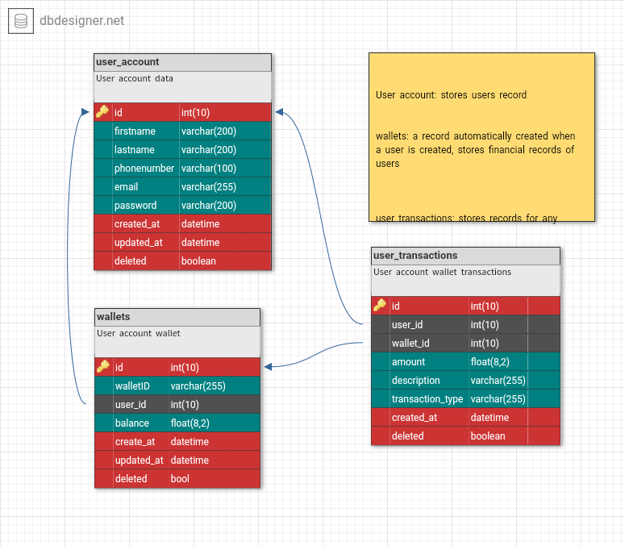

# Demo Credit Wallet Service

This is my submission repository to [Lendsqr Backend Engineer Assessment](https://docs.google.com/document/d/e/2PACX-1vRjhUo8U2gnOM-zZ3sfZxMZfNWtvWl6TxX7NKEUhDz83d--4b2llsT_vlEpFC5-ZSeQ_sXnBEf8V49B/pub).

<br/>

# Table of contents
- [Introduction](#introduction)
- [Features](#features)
- [Endpoints](#endpoints)
    - [User account endpoints](#user-account)
    - [User wallet endpoints](#user-wallet)
- [How to install](#how-to-install)
    - [Requirements](#requirements)
    - [Setup](#setup)
    - [Environment variables](#environment-variables)
- [Tech stack and tools](#tech-stack-and-tools)
- [ER Diagram](#er-diagram)
- [Notes](#notes)

<br/>

# Introduction
Demo Credit is a mobile lending app. Borrowers will have an account to receive loans they have been granted and also send the money for repayments. This is the backend service for Demo Credit mobile app.

<hr/> <br/><br/>

# Features
- Create account (and wallet which is automatically created for new user)
- Fund account
- Transfer fund to another user's account (wallet)
- Withdraw funds from thier account.

<hr/> <br/><br/>

# Endpoints
Things to note:
- authentication is done by adding
    ```json
    {
        ...,
        "Authentication": "Token {{token}}",
        ...
    }
    ```
    to request header. `{{token}}` should be replaced with generated user account token, which is in response to `/api/authenticate` request.

<br/>

## User account


| Endpoint  | Method | Response Codes | Requirements | Notes |
|--------- | :----------: | :--------: | :-----------: | :-----------: |
| `/api/account/` | POST   | 201, 422     | none | Create user data, account wallet is created automatically with 0.00 balance.
| `/api/account/` | GET   | 200, 400     | authentication | Get the authenticated account data.
| `/api/authenticate/` | POST   | 200, 422     | none | creates and returns authentication token.

> Usage of endpoints can be seen/tested in [postman collection]((https://links.getpostman.com/ls/click?upn=3y7nOEZSJOF1v-2Fv7UyshsFwjG-2B4WlOUfNd7JXVgH4-2B9PhygGhJ9L5M8NBEU7pvcukohvPbWLnIFeeA-2FJfhdN9KPnuta3mZ1OjOEXMGlwln2ne-2FcJ7EDTQ75YXphcNOyTd4JTmgDOXqYYKY7qPQQ6Dx-2Bu79c26Kfzp9xE4Ck9CTzU-2FUMpWnZ-2Fzkmn-2BVEE-2FcLCgJyW_t4dSyhpYn45UrIvWEZgqWjwRenYu2z2oLnzcJPHzDfhqVqk47pp57ttb7YBSw62-2BiHesUNAwfJWqV6QujfJf5sBJInGqngV5YTtYqIivALxAjlmyqfS58evOT0r9K07pYuJ9Vma0bay3ovD6Tbqt-2BqMUijpdI4YKCbAKfXNHzxCc3aejR61v2BAmUIOeonSbWgmrvw0V7-2BQtjxBQC6shspaLzcFbFXRZ3so6zBvGV12CobNxPGdbE8b0Ns4fcmvC6MqSJUDK-2F6POiqPYfOsvzQVl3ep6WmjCDDbD7QSn0HQUbzavto5cQVyhxQVc6V4z-2BFL8N93XFynGE7gpAQb-2B-2F5zt3E-2Btk0QHBA4jd19UKDc-3D))

<br/><br/>

## User Wallet

> This endpoints is expected to be used for accounts that's already existing and authenticated.

| Endpoint  | Method | Response Codes | Requirements | Notes |
|--------- | :----------: | :--------: | :-----------: | :-----------: |
| `/api/wallet/` | GET   | 200, 400     | authentication | Get authenticated user wallet data.
| `/api/wallet/fund` | POST   | 200, 400     | authentication | Top up wallet balance, amount sent must be non-negative and greater than 0.
| `/api/wallet/transfer` | POST   | 200, 400     | authentication | Deduct authenticated user wallet balance and send deducted amount to recipient wallet as topup, amount sent must be non-negative and greater than 0.
| `/api/wallet/withdraw` | POST   | 200, 400     | authentication | Deduct authenticated user wallet balance, amount sent must be non-negative and greater than 0.
 
> Usage of endpoints can be seen/tested in [postman collection]((https://links.getpostman.com/ls/click?upn=3y7nOEZSJOF1v-2Fv7UyshsFwjG-2B4WlOUfNd7JXVgH4-2B9PhygGhJ9L5M8NBEU7pvcukohvPbWLnIFeeA-2FJfhdN9KPnuta3mZ1OjOEXMGlwln2ne-2FcJ7EDTQ75YXphcNOyTd4JTmgDOXqYYKY7qPQQ6Dx-2Bu79c26Kfzp9xE4Ck9CTzU-2FUMpWnZ-2Fzkmn-2BVEE-2FcLCgJyW_t4dSyhpYn45UrIvWEZgqWjwRenYu2z2oLnzcJPHzDfhqVqk47pp57ttb7YBSw62-2BiHesUNAwfJWqV6QujfJf5sBJInGqngV5YTtYqIivALxAjlmyqfS58evOT0r9K07pYuJ9Vma0bay3ovD6Tbqt-2BqMUijpdI4YKCbAKfXNHzxCc3aejR61v2BAmUIOeonSbWgmrvw0V7-2BQtjxBQC6shspaLzcFbFXRZ3so6zBvGV12CobNxPGdbE8b0Ns4fcmvC6MqSJUDK-2F6POiqPYfOsvzQVl3ep6WmjCDDbD7QSn0HQUbzavto5cQVyhxQVc6V4z-2BFL8N93XFynGE7gpAQb-2B-2F5zt3E-2Btk0QHBA4jd19UKDc-3D))

<br/><br/>

## User Wallet Transactions (Extra)

> This endpoints were not part of requirements, but discerned to be useful.

| Endpoint  | Method | Response Codes | Requirements | Notes |
|--------- | :----------: | :--------: | :-----------: | :-----------: |
| `/api/wallet/transactions` | GET   | 200, 400     | authentication | Get authenticated user wallet transactions.
| `/api/wallet/transactions/:transaction_id` | GET   | 200, 400, 404     | authentication | Get authenticated user wallet transaction using `transaction_id` in request parameter.

> Usage of endpoints can be seen/tested in [postman collection]((https://links.getpostman.com/ls/click?upn=3y7nOEZSJOF1v-2Fv7UyshsFwjG-2B4WlOUfNd7JXVgH4-2B9PhygGhJ9L5M8NBEU7pvcukohvPbWLnIFeeA-2FJfhdN9KPnuta3mZ1OjOEXMGlwln2ne-2FcJ7EDTQ75YXphcNOyTd4JTmgDOXqYYKY7qPQQ6Dx-2Bu79c26Kfzp9xE4Ck9CTzU-2FUMpWnZ-2Fzkmn-2BVEE-2FcLCgJyW_t4dSyhpYn45UrIvWEZgqWjwRenYu2z2oLnzcJPHzDfhqVqk47pp57ttb7YBSw62-2BiHesUNAwfJWqV6QujfJf5sBJInGqngV5YTtYqIivALxAjlmyqfS58evOT0r9K07pYuJ9Vma0bay3ovD6Tbqt-2BqMUijpdI4YKCbAKfXNHzxCc3aejR61v2BAmUIOeonSbWgmrvw0V7-2BQtjxBQC6shspaLzcFbFXRZ3so6zBvGV12CobNxPGdbE8b0Ns4fcmvC6MqSJUDK-2F6POiqPYfOsvzQVl3ep6WmjCDDbD7QSn0HQUbzavto5cQVyhxQVc6V4z-2BFL8N93XFynGE7gpAQb-2B-2F5zt3E-2Btk0QHBA4jd19UKDc-3D))

<hr/><br/><br/>

# How to install

### Requirements
Before setting up this project, you should have the following:
- [NodeJS installed](https://nodejs.dev/en/download/)
- A RDMS installed (MYSQL expecially)

### Setup
- create a mysql database and take note of the connection credentials
- Creat a `.env` file from `.env.example` file in the root directory,
`.env.example` has the environment variables used in the application. [see variable names with description and data type expected](#environment-variables)

- run `npm install` or `yarn install` to install dependencies.
- run `npm run` or `yarn run` to start project server(e.g `http://localhost:3010/api`)

> make sure to run `npm run migrate` at least once, for knex to setup database. <br/><br/> to run tests, run `npm test`.

<br/><br/>
### Environment variables

| Varible  | Default Value | Required | Description |
|--------- | ------------ | -------- | ----------- |
| NODE_ENV | development   | True     | Used to detect if mode (options are 'development', 'production')
| PORT     | 3010          | True     | Port used by server on host system
| DB_HOST     | localhost          | True     | mysql database server host
| DB_PORT     |           | True     | mysql database server port
| DB_USER     |    root       | True     | mysql database server connection username
| DB_PASSWORD     |           | True     | mysql database server connection password
| DB_NAME     |   wallet_service_db        | True     | database name of the database created in previous step
| SECRET     |           | True     | encryption secret token


<hr/><br/><br/>

# Tech Stack and Tools
- NodeJs (LTS version)
- KnexJS ORM
- MYSQL Database
> Tools includes
- bcryptjs - Password encrytption
- express - app server
- jsonwebtokens - token authentication
- mysql2 - database adapter to work with knex

  and more dependencies which can be checked in the `dependencies` section of `package.json` file.

<hr/> <br/><br/>

### ER-Diagram
<p align="center">
  
</p>

> [Link to diagram source](https://dbdesigner.page.link/yQ5v3zfpbrRWhgU39)

### Notes
<hr/>

> Before using endpoints in postman collections, please create environment variables in postman, which includes:
> - `url` : domain name with the /api path (e.g `http:localhost:3010/api` without a trailing slash)
> - `token` : authentication token

<br/>

Postman collection: [use endpoints in postman](https://links.getpostman.com/ls/click?upn=3y7nOEZSJOF1v-2Fv7UyshsFwjG-2B4WlOUfNd7JXVgH4-2B9PhygGhJ9L5M8NBEU7pvcukohvPbWLnIFeeA-2FJfhdN9KPnuta3mZ1OjOEXMGlwln2ne-2FcJ7EDTQ75YXphcNOyTd4JTmgDOXqYYKY7qPQQ6Dx-2Bu79c26Kfzp9xE4Ck9CTzU-2FUMpWnZ-2Fzkmn-2BVEE-2FcLCgJyW_t4dSyhpYn45UrIvWEZgqWjwRenYu2z2oLnzcJPHzDfhqVqk47pp57ttb7YBSw62-2BiHesUNAwfJWqV6QujfJf5sBJInGqngV5YTtYqIivALxAjlmyqfS58evOT0r9K07pYuJ9Vma0bay3ovD6Tbqt-2BqMUijpdI4YKCbAKfXNHzxCc3aejR61v2BAmUIOeonSbWgmrvw0V7-2BQtjxBQC6shspaLzcFbFXRZ3so6zBvGV12CobNxPGdbE8b0Ns4fcmvC6MqSJUDK-2F6POiqPYfOsvzQVl3ep6WmjCDDbD7QSn0HQUbzavto5cQVyhxQVc6V4z-2BFL8N93XFynGE7gpAQb-2B-2F5zt3E-2Btk0QHBA4jd19UKDc-3D)
<br/>ER-Diagram: [View diagram on dbdesigner](https://dbdesigner.page.link/yQ5v3zfpbrRWhgU39)<br/>
Author: [Precious Olusola](https://github.com/codepraycode)<br/>
Email: preciousolusola16@gmail.com

<hr/> <br/><br/>
